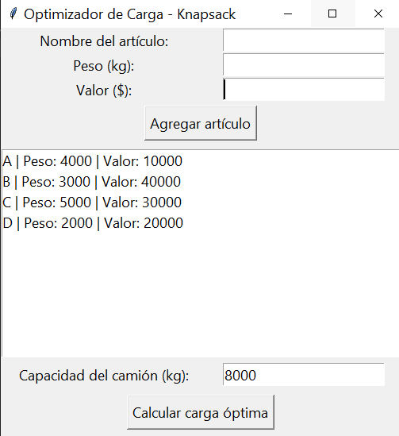
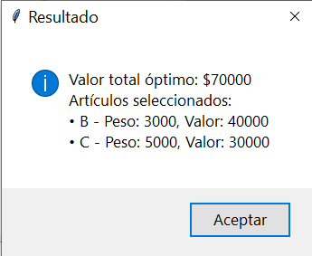
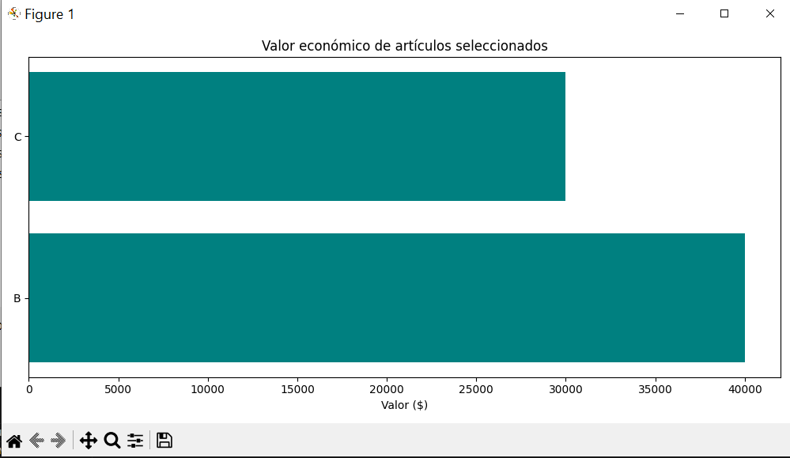

# Knapsack
Este programa propone una solución para el problema de la mochila, proporcionando una interfaz que permita al usuario ingresar los datos que se adecúen a su situación particular.

---

Como primer paso, se alimenta a la matriz de datos, para poder establecer los parámetros del algoritmo.
Ingresamos los objetos a evaluar (nombre, peso y valor) y la capacidad total del camión de carga.

  <strong>Inicio</strong>
   
  

Posteriormente, damos clic al botón de "Calcular carga óptima", el cuál activará una alerta en la que se desplegarán los resultados.

  <strong>Resultados</strong>
   
  

Finalmente, como adicional, se abrirá una ventana extra en la cuál se mostrará una gráfica que representa el ingreso que se realiza por el transporte de cada objeto.

  <strong>Grafica</strong>
   
  

